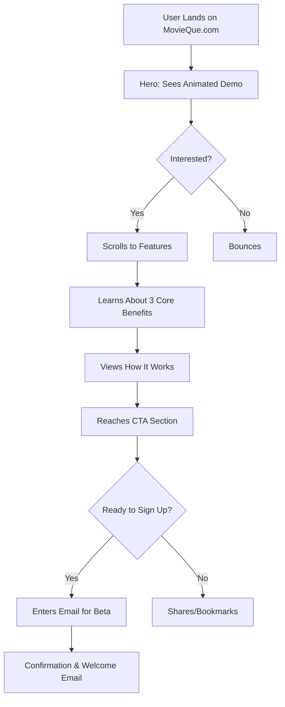

# 🎬 MovieQue Landing Page Architecture Plan

## Project Overview
**Domain**: movieque.com  
**Technology Stack**: SvelteKit + TypeScript + TailwindCSS  
**Brand Colors**: Bright Red (#FF0040) + Bright Blue (#0080FF)  
**Design Theme**: Dark layout with modern, engaging animations  
**Target Audience**: Movie enthusiasts and streaming subscribers (18-35) frustrated with discovery  

## Project Structure & Component Organization

```
src/
├── lib/
│   ├── components/
│   │   ├── ui/           # Reusable UI components
│   │   │   ├── Button.svelte
│   │   │   ├── Card.svelte
│   │   │   └── Input.svelte
│   │   ├── sections/     # Landing page sections
│   │   │   ├── HeroSection.svelte
│   │   │   ├── FeaturesSection.svelte
│   │   │   ├── HowItWorksSection.svelte
│   │   │   └── CTASection.svelte
│   │   └── animations/   # Animation components
│   │       ├── PhoneMockup.svelte
│   │       ├── AnimatedIcon.svelte
│   │       └── SwipeAnimation.svelte
│   ├── types/           # TypeScript type definitions
│   │   ├── movie.ts
│   │   └── streaming.ts
│   ├── utils/           # Utility functions
│   │   ├── animations.ts
│   │   └── constants.ts
│   └── stores/          # Svelte stores for state
│       └── ui.ts
├── routes/
│   └── +page.svelte     # Main landing page
└── static/
    └── assets/          # Images, icons, mockups
        ├── icons/
        ├── mockups/
        └── backgrounds/
```

## Landing Page Sections & Features

### 1. Hero Section
- **Primary Headline**: "Stop Endless Scrolling, Start Discovering"
- **Subheadline**: "Swipe through movie clips like TikTok, get instant access to watch on your favorite streaming platform"
- **Visual Element**: Animated Phone Mockup featuring:
  - TikTok-style interface showing movie clips
  - Swipe animations with red/blue accent colors
  - "Like" and "Skip" interactions
  - Smooth transitions between movie clips
- **Call-to-Actions**:
  - Primary: "Join the Beta" (bright red button)
  - Secondary: "Watch Demo" (blue outline button)

### 2. Features Section - "Three Problems, One Solution"

#### Problem 1: Discovery Fatigue
- **Icon**: Endless scroll animation
- **Title**: "No More 10-Minute Netflix Scrolls"
- **Description**: "Swipe through curated movie clips and trailers. Like what you see? Skip what you don't. It's that simple."

#### Problem 2: Unknown Movies
- **Icon**: Search/question mark animation
- **Title**: "Found It on TikTok? We'll Name It"
- **Description**: "See a movie clip you love but don't know the title? Our AI identifies it instantly from any clip or trailer."

#### Problem 3: Streaming Access
- **Icon**: Globe/VPN shield animation
- **Title**: "Watch Anywhere, Anytime"
- **Description**: "Automatically connects you to the right streaming platform in your region, or seamlessly enables VPN access when needed."

### 3. How It Works Section
- **Step 1**: "Swipe & Discover" - Animated phone showing swipe gestures
- **Step 2**: "Get Matched" - Streaming logos appearing with availability
- **Step 3**: "Watch Instantly" - Seamless transition to streaming platform

### 4. CTA Section
- **Headline**: "Ready to Transform Your Movie Nights?"
- **Beta signup form** with email capture
- **Social proof**: "Join 1,000+ movie lovers in early access"
- **Final CTA button**: "Get Early Access" (gradient red-to-blue)

## Design System & Styling

### Color Palette
```typescript
const colors = {
  primary: {
    red: '#FF0040',      // Bright red
    blue: '#0080FF',     // Bright blue
  },
  dark: {
    bg: '#0A0A0A',       // Deep black background
    surface: '#1A1A1A',  // Card backgrounds
    border: '#2A2A2A',   // Subtle borders
  },
  text: {
    primary: '#FFFFFF',   // White text
    secondary: '#A0A0A0', // Gray text
    accent: '#E0E0E0',    // Light gray
  },
  gradients: {
    primary: 'linear-gradient(135deg, #FF0040 0%, #0080FF 100%)',
    accent: 'linear-gradient(135deg, #FF0040 0%, #FF4080 100%)',
  }
}
```

### Typography
- **Headlines**: Bold, modern sans-serif (Inter/Poppins)
- **Body Text**: Clean, readable (Inter)
- **Accent Text**: Gradient text effects for key phrases
- **Font Sizes**: Responsive scaling from mobile to desktop

### Animations & Interactions
- **Scroll-triggered animations** using Intersection Observer
- **Phone mockup animations** showing swipe gestures
- **Gradient hover effects** on buttons and cards
- **Smooth transitions** between sections (0.3s ease-in-out)
- **Parallax effects** for depth and engagement
- **Micro-interactions** on buttons and form elements

## Technical Implementation Strategy

### Component Architecture
```typescript
// Type definitions
interface MovieClip {
  id: string;
  title: string;
  thumbnail: string;
  duration: number;
  genre: string[];
  year: number;
}

interface StreamingPlatform {
  name: string;
  logo: string;
  available: boolean;
  region?: string;
  url?: string;
}

interface FeatureItem {
  icon: string;
  title: string;
  description: string;
  animation?: string;
}
```

### Animation Strategy
- **CSS animations** for simple transitions and hover effects
- **Svelte transitions** for component enter/exit animations
- **Intersection Observer API** for scroll-triggered effects
- **Custom easing functions** for smooth, professional animations

### Responsive Design Breakpoints
- **Mobile**: 320px - 767px (stack vertically, larger touch targets)
- **Tablet**: 768px - 1023px (2-column layouts, medium spacing)
- **Desktop**: 1024px - 1439px (3-column layouts, optimal spacing)
- **Large Desktop**: 1440px+ (max-width container, enhanced visuals)

### Performance Optimizations
- **Lazy loading** for images and animations
- **Optimized SVG icons** for fast loading
- **Minimal JavaScript** leveraging Svelte's efficiency
- **Critical CSS inlining** for above-the-fold content
- **Image optimization** with WebP format and responsive sizes

## User Flow Diagram



## Content Strategy

### Headlines & Copy Tone
- **Relatable and slightly playful**
- **Solution-focused messaging**
- **Emphasis on time-saving and frustration relief**
- **Clear, concise benefit statements**

### Key Messages
- **Hero**: "Stop Endless Scrolling, Start Discovering"
- **Features**: "Three Problems Every Movie Lover Faces"
- **How It Works**: "From Swipe to Stream in Seconds"
- **CTA**: "Ready to Transform Your Movie Nights?"

### Microcopy
- **Button Text**: "Join the Beta", "Watch Demo", "Get Early Access"
- **Form Labels**: "Enter your email for early access"
- **Social Proof**: "Join 1,000+ movie lovers already discovering"
- **Loading States**: "Finding your perfect movie...", "Almost there..."

## Development Phases

### Phase 1: Foundation
1. Set up component structure
2. Implement design system and color palette
3. Create reusable UI components (Button, Card, Input)

### Phase 2: Core Sections
1. Build Hero section with animated mockup
2. Implement Features section with icons and animations
3. Create How It Works section with step-by-step flow

### Phase 3: Interactions & Polish
1. Add scroll-triggered animations
2. Implement form handling for beta signup
3. Add responsive design optimizations

### Phase 4: Performance & Testing
1. Optimize images and animations
2. Test across devices and browsers
3. Implement analytics and tracking

## Success Metrics
- **Primary**: Beta signup conversion rate
- **Secondary**: Time on page, scroll depth
- **Engagement**: Demo video play rate, feature section interaction
- **Technical**: Page load speed, mobile performance score

---

**Next Steps**: Implement this plan using SvelteKit with TypeScript, ensuring all components are properly typed and modular for easy maintenance and future enhancements.